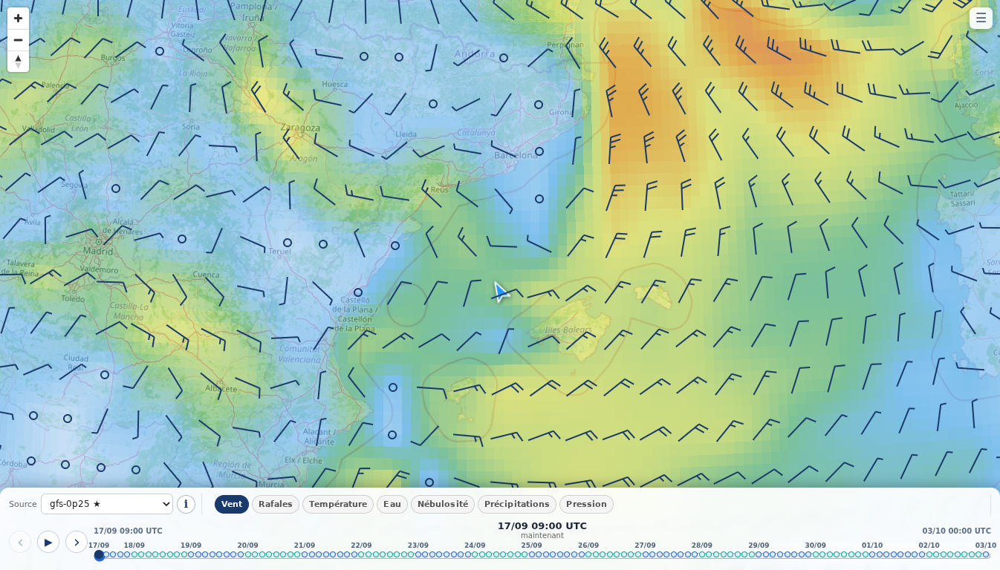

# signalk-weather-map

A [SignalK](https://signalk.org) webapp that displays meteorological forecast data on an interactive MapLibre globe — wind barbs, temperature, sea-surface temperature, cloudiness, precipitation, pressure and gusts, powered by any SignalK weather provider.



## Features

- **Wind barbs** — standard meteorological notation (½ bar = 5 kt, bar = 10 kt, pennant = 50 kt)
- **Gusts** — same barb display based on gust speed
- **Temperature** — colour-coded cells with numeric label (blue → green → yellow → red)
- **Sea-surface temperature** — dedicated −2 to 35 °C colour scale with numeric labels
- **Cloudiness** — transparency-based grey overlay (0 % = transparent, 100 % = dark grey)
- **Precipitation** — colour-coded intensity (transparent → light blue → blue → purple → red)
- **Pressure** — colour-coded cells with numeric hPa label (dark blue = storm/low < 960 → cyan → green ≈ 1013 → orange → dark red = anticyclone > 1022)
- **3D globe** — MapLibre globe projection keeps weather patterns legible at high latitudes
- **Automatic grid density** — stable spacing adapts to zoom level (~36 px between points)
- **Forecast time slider** — browse all steps, or play them in a continuous loop
- **Multi-provider support** — select any registered SignalK weather provider; inspect its coverage, steps and layers, and set it as default from its information panel
- **Responsive control dock** — fixed two-row dock, full timeline and independently hideable legend
- **Vessel position** — boat marker oriented to true heading (falls back to north if unavailable)
- **Client-side cache** — 30-minute localStorage + memory cache; parallel batch fetching (15 concurrent)
- **i18n** — UI language detected from the browser (French and English supported)

## Requirements

- SignalK server with at least one weather provider plugin installed and enabled  
  (e.g. [signalk-grib-weather-provider](https://github.com/macjl/signalk-grib-weather-provider), Open-Meteo, etc.)
- Node.js ≥ 18
- A browser with WebGL2 and hardware acceleration enabled

## Installation

### From npm (recommended)

In the SignalK server's app store, search for **signalk-weather-map** and install it.

Or from the command line inside the SignalK data directory:

```sh
npm install signalk-weather-map
```

Then restart the SignalK server.

### Manual / development

```sh
cd ~/.signalk/   # or your SignalK data directory
mkdir -p local-plugins
git clone https://github.com/macjl/signalk-weather-map local-plugins/signalk-weather-map
# Add to package.json dependencies:
#   "signalk-weather-map": "file:./local-plugins/signalk-weather-map"
npm install
```

## Usage

Once installed, the webapp is available at:

```
http://<signalk-host>:<port>/signalk-weather-map/
```

Or open it from the SignalK dashboard → **Webapps**.

### Layer selector

| Layer | Description |
|---|---|
| Wind | Barbs based on true wind speed |
| Gusts | Barbs based on gust speed |
| Temperature | Colour-coded cell fill with °C label |
| Water | Sea-surface temperature colour fill with °C label |
| Cloudiness | Grey transparency proportional to cloud cover |
| Precipitation | Colour intensity proportional to rain volume |
| Pressure | Colour-coded cell fill with hPa label (blue = low, red = high) |

### Tooltip

Hover over any cell to see full data: wind speed & direction, gusts, temperature, MSLP, humidity, cloud cover and precipitation.

### Provider selector

If multiple weather providers are registered, select one from the **Source** dropdown. Use the **i** button to inspect coverage, forecast steps and layers, or to make it the server-wide default.

## Weather API

This plugin uses the standard SignalK v2 Weather API:

```
GET /signalk/v2/api/weather/forecasts/point?lat=&lon=&provider=<pluginId>
GET /signalk/v2/api/weather/_providers
POST /signalk/v2/api/weather/_providers/_default/:id
```

Any provider that implements this API is compatible.

## Development

```sh
git clone https://github.com/macjl/signalk-weather-map
cd signalk-weather-map
# Edit public/index.html — no build step required (vanilla JS + MapLibre CDN)
```

## License

MIT © Jean-Laurent Girod
